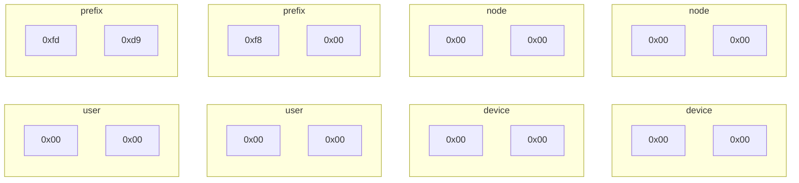

# config example

```yaml
Addrs: ["fdd9:f800::1/24"]
PrivateKey: oFk/ZbUSGDpJaUeDMzBSdwGFQcSBHsN9ox5gJv5nLkc=

Peers:
  - PublicKey: 5G1bNXPp6cfxo2kbXQk7avuh7abuj55ATPDoYCweHkI=
    AllowedIPs: ["fdd9:f800::2"]
    Endpoint: device.user.xhe.remoon.net
```

# IP 地址分配

只对 ipv6 分配做要求, 前缀为 `fdd9:f800::/24` (为啥不是`/32`段, `00` 这 8 位是保留段, 暂不使用

每个 node 有 2\*\*64 的地址可分配, 假设 node 获得的 ip 为 1, 则 node 可分配的路由段 `fdd9:f800:0:1::/64`

建议 node 对每个 user 分配 32 位地址, 假设 user 获得的 ip 为 1, 则 user 可分配的路由段 `fdd9:f800:0:1:0:1::/96`

(这只是建议, node 可以分配更少的可用地址段给用户, 如 `fdd9:f800:0:1:0:0:1::/112`, 只有 16 位(65536 个地址)可自由分配

ps: 32 位有将近 43 亿个地址可分配



# node 获得可分配的地址段

服务端称为 node, node 的作用是节点间交换地址信息

### 为什么要加个"获得可分配的地址段"的步骤呢?

单个 node 只能保证自身范围内 ip 地址不冲突, 如果有多个 node 的就会出现地址冲突, 于是需要
一个地址分配中心

### 如何获得地址

向指定的 XMR 钱包地址发送 0.1XMR(约 100RMB) 获得一个 ip 地址 5 年的使用权, ip 地址递增,
交易信息里需要带上公钥, 不带上公钥默认为捐赠不获得 ip 地址, 到期后再逾期 1 年后回收 ip 地址

地址续费, 续费信息格式为: `还未确定`

该 XMR 钱包会公开查看密钥便于第三方生成 ip <-> 公钥 映射

# Todo

- [ ] 配置热重载
- [ ] ipv4 nat ipv6
